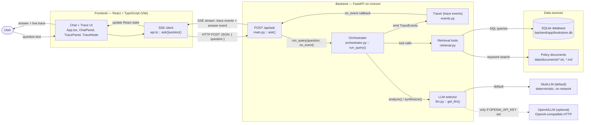
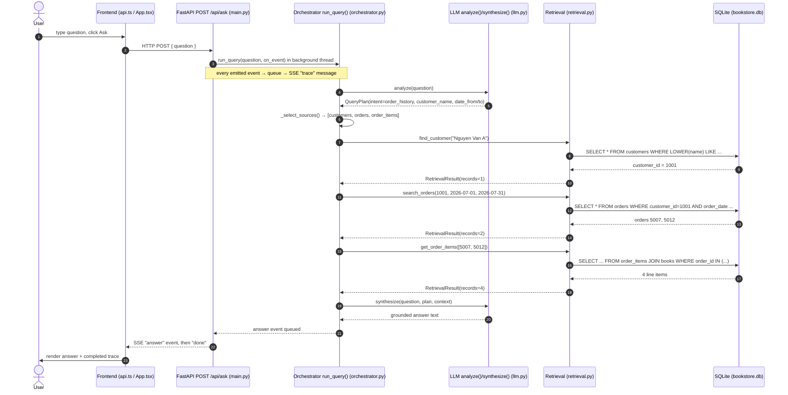
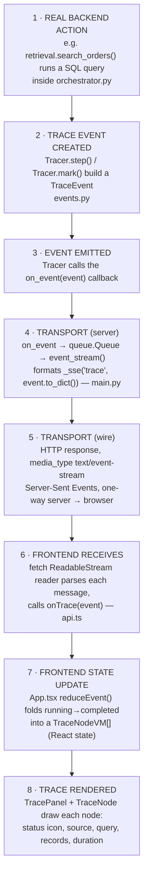
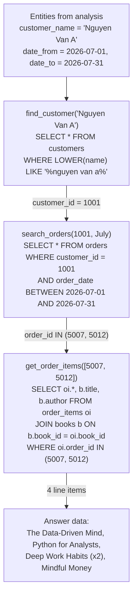
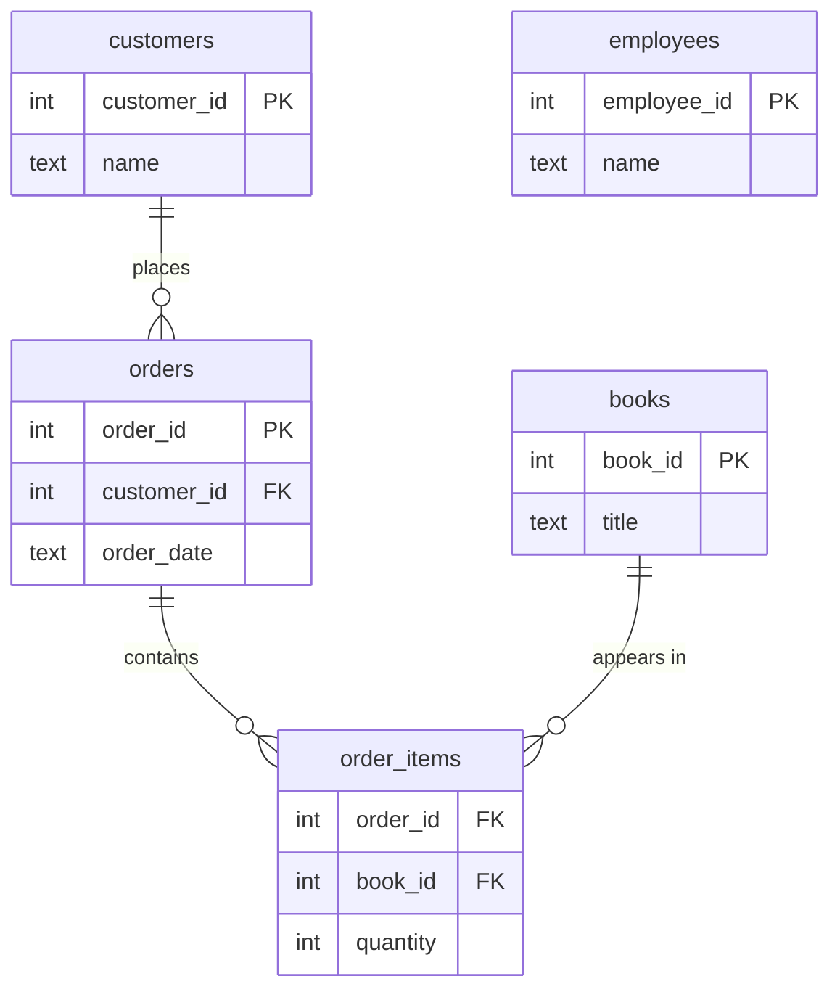

# Kamiya Bookstore — System Architecture & Diagrams

Diagrams generated **from the actual code** in this repository (verified file by
file). Where a detail is conditional or unconfirmed, it is marked explicitly.

## 0. Overall architecture summary

The system is a two-part application:

- **Frontend** — a React + TypeScript app (Vite, Tailwind) in `frontend/`. It
  sends the user's question to the backend and renders two things: the answer,
  and a live execution trace. (`src/api.ts`, `src/App.tsx`, `src/components/*`.)
- **Backend** — a FastAPI app in `backend/app/`. One endpoint (`POST /api/ask`)
  runs the question through an orchestrator and **streams** the trace back using
  **Server-Sent Events (SSE)**, ending with the answer. (`main.py`,
  `orchestrator.py`, `events.py`, `retrieval.py`, `llm.py`, `llm_openai.py`.)

The orchestrator follows a fixed pipeline: **analyze → select sources → retrieve
→ synthesize**. Retrieval is deterministic Python over a **SQLite** database
(built from JSON/CSV files) plus a **keyword search over policy documents**. The
**LLM** is used only for query analysis and final answer wording.

**Important accuracy note on the LLM:** the code selects the provider at runtime
in `llm.py :: get_llm()`. If the environment variable `OPENAI_API_KEY` is set, it
uses `OpenAILLM` (an OpenAI-compatible client, `llm_openai.py`). **If not, it uses
`StubLLM`, a deterministic local implementation with no network call.** So "uses
OpenAI" is true only when a key is configured; the default is the stub. Diagrams
below show both and mark the OpenAI path as conditional.

There is also a **second entry point**: `scripts/ask.py`, a CLI that calls the
same `run_query()` and prints the trace to the terminal. It uses the identical
pipeline — only the display differs.

---

## Diagram 1 — High-Level System Architecture

**Purpose:** show every component that exists and how they communicate.

**Plain English:** the browser sends the question over one HTTP POST. The backend
runs it through the orchestrator, which asks the LLM to understand and later word
the answer, and calls deterministic retrieval tools that read SQLite and the
document files. As it works, it emits trace events. The backend streams those
events — and finally the answer — back over a single SSE connection, and the UI
renders them live.

**Components:**
- **User / UI** — types a question, sees answer + trace.
- **api.ts `askQuestion()`** — sends the POST and parses the SSE stream.
- **`POST /api/ask` (`main.py :: ask()`)** — the only question endpoint; returns a
  `text/event-stream`. (There is also `GET /api/health`.)
- **Orchestrator (`run_query()`)** — the fixed analyze→select→retrieve→synthesize
  pipeline; the only place that emits trace events.
- **Tracer (`events.py`)** — creates the structured trace events.
- **Retrieval (`retrieval.py`)** — deterministic tools that query the data.
- **LLM selector (`get_llm()`)** — returns `StubLLM` or `OpenAILLM`.
- **SQLite (`bookstore.db`)** — tables: customers, books, orders, order_items,
  employees (built by `scripts/load_data.py`).
- **Documents** — policy/company text files searched by keyword.

**Key arrows:**
- **Frontend → Backend:** HTTP POST with JSON `{ question }`.
- **Backend → LLM:** a local call (stub) or an OpenAI-compatible HTTP call.
- **Backend → Retrieval → SQLite/Documents:** SQL queries / keyword search.
- **Backend → Frontend:** one SSE stream carrying **both** the trace events and
  the final answer event (not two separate channels).

---

## Diagram 2 — End-to-End Request Flow

**Purpose:** trace one real request — *"What books did Nguyen Van A buy in July?"*
— through the actual functions.

**Per-step detail (file · function · input → output):**

| # | Step | File · function | Input | Output |
|---|------|-----------------|-------|--------|
| 1 | Submit question | `api.ts :: askQuestion()` | question string | HTTP POST body |
| 2 | Receive request | `main.py :: ask()` | `AskRequest{question}` | starts stream + thread |
| 3 | Run pipeline | `orchestrator.py :: run_query()` | question | answer + events |
| 4 | Query analysis | `llm.py :: StubLLM.analyze()` (or `llm_openai.py :: OpenAILLM.analyze()`) | question | `QueryPlan(intent, entities)` |
| 5 | Source selection | `orchestrator.py :: _select_sources()` | intent | `[customers, orders, order_items]` |
| 6 | Customer lookup | `retrieval.py :: find_customer()` | "Nguyen Van A" | customer_id 1001 |
| 7 | Order lookup | `retrieval.py :: search_orders()` | 1001, July range | orders 5007, 5012 |
| 8 | Order-item lookup | `retrieval.py :: get_order_items()` | [5007, 5012] | 4 book line items |
| 9 | Answer generation | `llm.py :: StubLLM.synthesize()` (or OpenAI) | question + retrieved rows | answer text |
| 10 | Response returned | `main.py :: event_stream()` | queued events | SSE answer + done |
| 11 | Display | `App.tsx` + `TracePanel`/`ChatPanel` | SSE events | rendered UI |

> With the **stub**, steps 4 and 9 are local function calls (no network). With an
> **OpenAI key**, they become OpenAI-compatible HTTP calls. Retrieval (6–8) is
> always deterministic SQL.

---

## Diagram 3 — Execution Trace Architecture (most important)

**Purpose:** show how the system records what actually happened and gets it on
screen — and why it is a real trace, not a scripted animation.

**The TraceEvent structure** (`events.py`, dataclass) — the exact fields sent as
JSON: `seq`, `phase`, `label`, `status` (`running`/`completed`/`failed`/`info`),
`started_at`, `source`, `query`, `records_found`, `duration_ms`, `detail`.

**Where each stage happens:**
- **Created:** inside `run_query()` and the `_retrieve_*` branches, via
  `Tracer.step(...)` (a context manager that emits a `running` event, runs the
  real work, then emits a `completed`/`failed` event with the measured duration)
  and `Tracer.mark(...)` (one-shot markers like `REQUEST_RECEIVED`, `NOT_FOUND`,
  `COMPLETED`).
- **Emitted:** the `Tracer` calls `on_event(event)`. In the web path this is the
  lambda in `main.py` that puts the event on a `queue.Queue`.
- **Transported:** `event_stream()` drains the queue and writes each event as an
  SSE message (`_sse()`), returned as a `StreamingResponse` of
  `media_type="text/event-stream"`.
- **Received:** `api.ts :: askQuestion()` reads the response body with a streaming
  reader, splits on the SSE blank-line delimiter, and calls `onTrace`.
- **Stored:** `App.tsx :: reduceEvent()` builds/updates a `TraceNodeVM[]` in React
  state (and keeps the raw events too).
- **Rendered:** `TracePanel` maps the nodes to `TraceNode` components.

**Why this is a REAL trace, not a hard-coded animation:**
- Events are emitted **from inside the running pipeline**, at the exact points
  where the work happens — `Tracer.step()` literally wraps each real function
  call. If a step doesn't run, no event is emitted.
- Each `DATA_RETRIEVAL` event's `query` and `records_found` are taken from the
  **actual `RetrievalResult`** returned by the SQL query — e.g. a real "0 records"
  triggers a real `NOT_FOUND`.
- The frontend has **no fixed list of steps**. `reduceEvent()` builds the node
  list purely from whatever events arrive, so the picture always matches reality.
- **Full transparency:** the *only* artificial element is an optional per-event
  delay (`SSE_STEP_DELAY_MS`, default 250 ms) that paces **when events are sent**
  so a human can watch them. It delays transmission; it does **not** invent any
  step, and the `duration_ms` values shown are the real measured timings. Set it
  to `0` and the same real events stream as fast as possible.

---

## Diagram 4 — Data Retrieval Flow

**Purpose:** show how information is actually found for the example question, with
the real filters, and the table relationships behind it.

**Underlying schema** (from `scripts/load_data.py`):

**Plain English:** for order-history questions the system chains three lookups —
name → customer id, then that id + date range → orders, then those order ids →
the books in them (joined to titles). Each arrow is a real SQL query. The
`employees` table is loaded but **no current question type reads it** (marked so
you don't claim otherwise).

> **Verified against the data:** customer "Nguyen Van A" = `customer_id 1001`;
> his July 2026 orders are `5007` and `5012`; those contain 4 line items (Deep
> Work Habits ×2). These are the exact values the tests assert.

Other retrieval paths that exist in the code: `count_orders()` (for "how many
orders" questions), `search_books()` (catalogue/genre search), and
`search_documents()` (keyword search over the policy files — used for
returns/shipping/FAQ questions).

---

## Architecture consistency check

1. **Consistent with the code?** Yes — every function, endpoint, table, and flow
   above was read from the source files listed.
2. **Any component shown that doesn't exist?** No. The one thing to state
   carefully: **OpenAI is optional** (only when `OPENAI_API_KEY` is set); the
   default runtime is the deterministic `StubLLM`. The diagram marks that path as
   conditional.
3. **Anything important missing?** Two honest notes: (a) the `employees` table is
   loaded but unused by any question type; (b) there's a CLI entry point
   (`scripts/ask.py`) that runs the same pipeline without the frontend.
4. **Does the trace represent real execution?** Yes — events are emitted from
   inside the pipeline at the moment each step runs, and the queries/record
   counts come from the real retrieval results.
5. **Any fake/hard-coded trace behavior?** Only the optional inter-event *delay*
   for visibility (`SSE_STEP_DELAY_MS`). It changes *when* events are sent, not
   *what* they contain; durations are real. No step is fabricated.
6. **Are the arrows technically accurate?** Yes: POST for the request; SSE
   (`text/event-stream`) one-way for the response/trace; SQL to SQLite; keyword
   search to document files; local or OpenAI-HTTP for the LLM.
7. **Architectural weaknesses?** See next section.
8. **What would change for production?** See next section.

---

## Important technical weaknesses (be honest about these)

- **Single-process, in-memory streaming.** Each request spawns a background
  thread and an in-memory `queue.Queue`. Fine for a local demo / one user; it
  would need a proper task/queue model to scale.
- **No auth, no rate limiting, `CORS allow_origins=["*"]`.** Acceptable locally,
  not for production exposure.
- **SQLite, single file.** Great for a PoC; a multi-user production system would
  move to a networked database (e.g. Postgres).
- **Document search is keyword-frequency**, not semantic — deliberately simple
  and correct at this scale, but it won't handle paraphrased document queries.
- **Stub entity extraction is heuristic** (regex/keywords). The real LLM handles
  messy phrasing far better; the stub is a reliability/offline convenience.
- **Grounding is prompt-enforced, not verified.** On the OpenAI path the model is
  *instructed* to answer only from context (and "not found" cases short-circuit
  before it), but there's no automated check that every fact in the wording maps
  to a retrieved record.
- **`employees` data is unused**, and there's no pagination/limit on retrieval
  results.
- **Fetch-based SSE doesn't auto-reconnect** (unlike the browser `EventSource`
  object) because the request is a POST; a dropped stream isn't retried.

**For production I'd:** add authentication + a real database; replace the
in-memory queue with a managed streaming/queue mechanism; lock down CORS; add
input validation and rate limits; add citation-level grounding checks on LLM
answers; and add logging/metrics around the trace.

---

## How to explain each diagram out loud

Natural, non-scripted phrasings at three lengths.

### Diagram 1 — System Architecture
- **15s:** "It's a React front end and a FastAPI back end. The browser sends one
  question; the back end figures out the answer from a small database and some
  policy files, and streams back both the answer and a live trace of what it did."
- **30s:** "The front end is just the screen — it sends the question and shows the
  answer and the trace. The back end does the real work: an orchestrator that
  understands the question, picks which data to look at, runs the actual queries
  against SQLite and the documents, and uses an LLM only to read the question and
  word the answer. Everything comes back over a single streaming connection."
- **1min:** "There are two halves. The front end, in React, sends the user's
  question to one endpoint and renders what streams back. The back end, in
  FastAPI, runs a fixed pipeline — analyze, pick sources, retrieve, then write the
  answer. Retrieval is plain SQL over a SQLite database plus a keyword search over
  policy text files, so it's exact and fast. The LLM is only used at the edges —
  to interpret the question and to phrase the final answer — and it's optional:
  without an API key it runs a deterministic local stub, which is why the demo
  works offline. As the pipeline runs it emits trace events, and those stream to
  the browser live alongside the answer."

### Diagram 2 — Request Flow
- **15s:** "One question walks through five steps: understand it, find the
  customer, find their orders, find the books in those orders, then write the
  answer."
- **30s:** "When you ask what Nguyen Van A bought in July, the back end first
  works out that it's an order-history question about that customer in that date
  range. Then it looks the customer up to get their id, uses that id plus the date
  range to find the orders, and joins those orders to the books. Only then does it
  write the answer — from those exact rows."
- **1min:** "The front end posts the question to `/api/ask`. The back end runs it
  on a background thread so it can stream progress. First it analyzes the
  question into an intent and entities — here, order history for Nguyen Van A in
  July. It maps that to three data sources. Then it runs three real queries in
  order: name to customer id, customer id plus dates to orders, order ids to the
  books inside them — that's 1001, then orders 5007 and 5012, then four book line
  items. Finally it hands those rows to the answer step, which words the reply.
  Each of those steps emits a trace event as it happens, and the answer comes back
  at the end of the same stream."

### Diagram 3 — Execution Trace
- **15s:** "Every step the back end takes emits a small event, and those events
  stream to the screen live — so you're watching the real work, not a cartoon."
- **30s:** "As the pipeline runs, a Tracer wraps each step and emits a structured
  event — which source, which query, how many records, how long it took. Those
  events go onto a queue and stream to the browser as Server-Sent Events. The
  front end folds each 'started' and 'finished' pair into a node that flips from
  a spinner to a green check. Nothing is pre-scripted."
- **1min:** "This is the part the assessment cares about most. The back end
  doesn't log after the fact — it emits an event at the exact moment each step
  runs. A helper called the Tracer wraps every step: it fires a 'running' event,
  does the real work, times it, then fires a 'completed' event with the real query
  and record count. Those events are pushed onto a queue and streamed to the
  browser over Server-Sent Events — a one-way live channel. The front end reads
  them as they arrive and builds the trace purely from what it receives; it has no
  hard-coded list of steps. The only thing that's staged is an optional quarter-
  second pause between events so a human can follow along — but the steps and the
  timings themselves are all real. If a customer isn't found, you literally see a
  'zero records' then a 'not found' event, because that's what actually happened."

### Diagram 4 — Data Retrieval
- **15s:** "It's three linked lookups: customer, then their orders, then the books
  in those orders — each one a real database query."
- **30s:** "The data is relational, like a mini shop database. To answer what
  someone bought, you go customer → orders → order items → books. So the system
  turns the name into an id, filters orders by that id and the month, then joins
  those orders to the book titles. The filters you see in the trace are the actual
  SQL conditions."
- **1min:** "The information lives in a small SQLite database with four related
  tables — customers, orders, order_items, and books — plus some policy text
  files on the side. For an order-history question the system walks the
  relationships: it matches the name to a customer id, uses that id and the date
  range to pull the orders, then joins the order lines to the books to get titles
  and quantities. Every arrow in the diagram is one real query, and the trace
  shows the exact filters — customer_id 1001, the July date range, orders 5007 and
  5012. Because it's real SQL over structured data, the answers are exact and
  repeatable, which is why we didn't need a vector database here."

---

## What you should know before presenting

- **Lead with the trace.** That's what's being assessed. Say plainly: "the trace
  is emitted by the real pipeline, so it can't disagree with what happened."
- **Own the LLM nuance.** "It's built for an OpenAI-compatible model, and it runs
  a deterministic stub by default so the demo is 100% reproducible — I can switch
  the real model on with an API key and nothing else changes." This sounds
  confident and is exactly true.
- **Explain the one honest caveat before they find it:** the small pacing delay
  is cosmetic; the steps and timings are real.
- **Know your example numbers cold:** 1001, orders 5007/5012, four line items.
- **Have the design reasons ready:** SQLite + real SQL because the data is
  relational and the queries are showable; SSE because the trace only flows one
  way; hybrid (LLM at the edges, deterministic retrieval in the middle) so answers
  stay exact and can't hallucinate entities.

## Likely questions the company may ask

1. Is the trace real or just an animation?
2. Are you actually using OpenAI?
3. Why SQLite and not a "real" database or a vector database?
4. How does it avoid hallucinating?
5. Why Server-Sent Events instead of WebSockets?
6. Does this scale to many users?
7. What happens on an error, or if the customer doesn't exist?
8. Where's the boundary between the "AI" and the plain code?

## Suggested natural answers

1. **Real.** "Each event is emitted from inside the pipeline as the step runs, and
   the query and record count come straight from the database result. The front
   end just draws whatever arrives — there's no pre-written script."
2. **"It can, and it's designed for it."** "By default it runs a deterministic
   local stand-in so the demo is reproducible and needs no key. Set an API key and
   it uses an OpenAI-compatible model for exactly two steps — understanding the
   question and wording the answer — with the data access unchanged."
3. **"The data is relational, so exact SQL is the right tool"** — and it's
   showable in the trace. "A vector database would be slower to set up and fuzzier
   here; I only used keyword search for the free-text policy documents."
4. **"The answer is built only from retrieved rows,"** and 'not found' cases stop
   before the answer step, so it can't invent a customer or an order. "I also have
   tests that assert it says 'not found' for someone who isn't in the data."
5. **"The trace only flows one way, server to browser,"** which is exactly what
   Server-Sent Events are for — simpler than WebSockets, which are bidirectional.
6. **"As a proof of concept it's single-process and in-memory, which is fine for a
   demo. For production I'd add a real database, authentication, and a managed
   streaming mechanism"** — then it scales.
7. **"Errors become a visible ERROR event and a friendly message — the server
   doesn't crash. An unknown customer shows a 'not found' step"** — I have tests
   for both.
8. **"The AI is only at the two edges — reading the question and wording the
   answer. Everything in between, the actual data retrieval, is deterministic
   Python. That split is what keeps it accurate and observable."**

---

### Source files referenced
- Frontend: `frontend/src/api.ts`, `App.tsx`, `types.ts`,
  `components/{ChatPanel,TracePanel,TraceNode,Header}.tsx`
- Backend: `backend/app/{main,orchestrator,events,retrieval,llm,llm_openai,db,config}.py`
- Data build: `backend/scripts/{generate_data,load_data}.py`; CLI: `scripts/ask.py`
